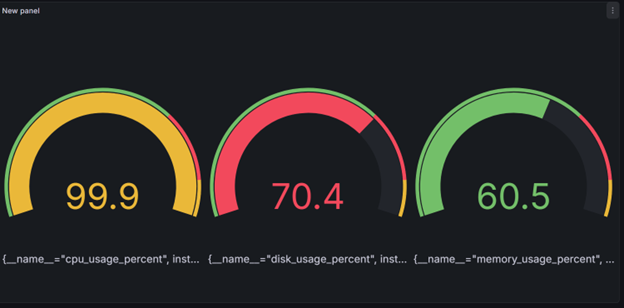
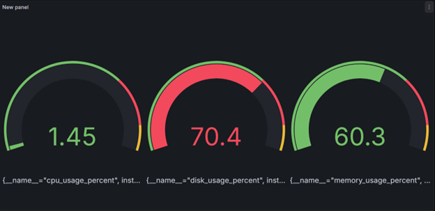
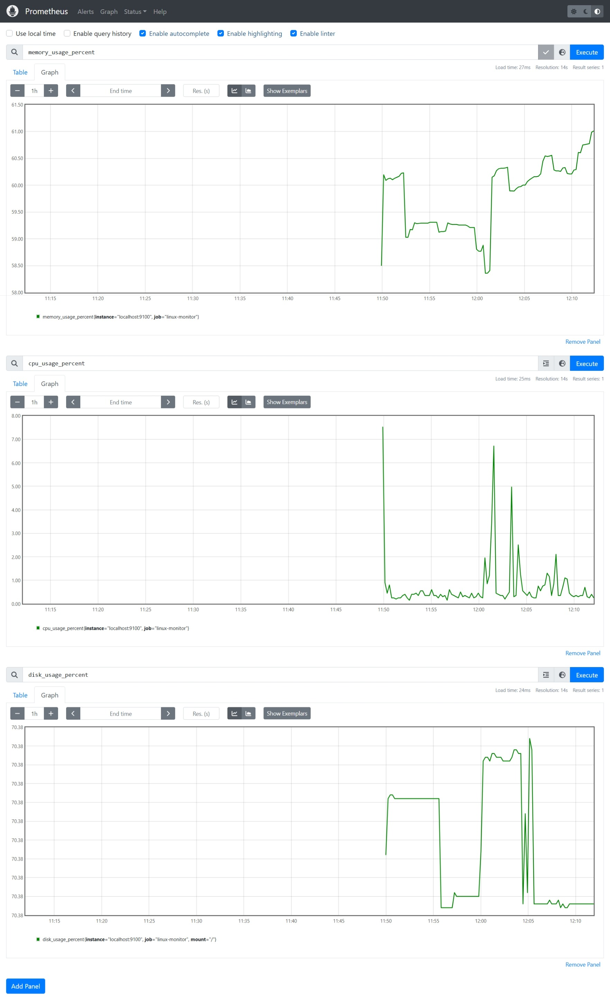

# 🖥 Linux System Monitor (C++)

A lightweight Linux system monitoring tool written in **C++17** with two implementations:

1. 📁 JSON Logging Version – Stores system metrics in JSON format  
2. 📊 Prometheus + Grafana Version – Real-time monitoring with visualization  

Tested on **Red Hat Enterprise Linux 9** using Docker / Podman.

---

# 📂 Project Structure

```
linux-monitor/
│
├── json-version/
├── prometheus-version/
├── docker-compose.yml
├── prometheus.yml
├── screenshots/
│   ├── Picture1.png
│   ├── Picture2.png
│   └── Picture3.png
└── README.md
```

---
# 🔹 Version 1 — JSON Logging Monitor

## 🎯 Overview

This version collects system metrics from the Linux `/proc` filesystem and stores them inside a JSON file.

Designed for:
- Offline analysis
- Log storage
- Lightweight monitoring

---
## 🐳 Build

```bash
cd json-version
podman build -t linux-monitor-json .
(or use docker build if using Docker)
▶️ Run
podman run --rm linux-monitor-json
Logs will be saved inside the container unless a volume is mounted.
________________________________________


# 🔹 Version 2 — Prometheus + Grafana (Real-Time Monitoring)

## 🎯 Overview

This version exposes system metrics through an HTTP endpoint compatible with Prometheus.

Prometheus scrapes the metrics and Grafana visualizes them in real time.

---

# 🏗 Architecture

```

┌───────────────┐     scrape     ┌───────────────┐
│ C++ Monitor   │──────────────>│ Prometheus     │
│ (Port 9100)   │               │ (Port 9090)    │
└───────────────┘               └─────┬─────────┘
                                        │
                                        ▼
                                   ┌─────────────┐
                                   │ Grafana     │
                                   │ (Port 3000) │
                                   └─────────────┘

                                   
```


🐳 Build Monitor
cd prometheus-version
podman build -t linux-monitor-prometheus .
▶️ Run Monitor
podman run -p 9100:9100 linux-monitor-prometheus
Test:
http://localhost:9100/metrics
You should see:
cpu_usage_total 23.4
memory_usage 61.2
________________________________________
🔹 Prometheus Setup
Download Prometheus from:
https://prometheus.io/download/
Edit prometheus.yml:
global:
  scrape_interval: 2s

scrape_configs:
  - job_name: "linux_monitor"
    static_configs:
      - targets: ["localhost:9100"]
Start Prometheus:
./prometheus --config.file=prometheus.yml
Access:
http://localhost:9090
________________________________________
🔹 Grafana Setup
Download Grafana from:
https://grafana.com/grafana/download
Start Grafana and open:
http://localhost:3000
Default login:
admin / admin
Add Data Source:
•	Type: Prometheus
•	URL: http://localhost:9090
•	Click "Save & Test"
Create dashboard panels using:
cpu_usage_total
memory_usage
Set Max value to 100 for CPU gauge.
________________________________________
🔥 Generate CPU Load for Testing
Single core:
yes > /dev/null
All cores:
for i in $(seq 1 $(nproc)); do yes > /dev/null & done
Stop:
killall yes


---

# 📊 Screenshots

## 🔵 Grafana Dashboard – CPU & Memory Monitoring



---

## 🔵 Grafana Dashboard – Detailed Metrics View



---

## 🔵 Prometheus Metrics Endpoint



---

# 🐳 Run Full Stack (Docker Compose)

```bash
docker-compose up -d
```

Access:

- Monitor: http://localhost:9100/metrics
- Prometheus: http://localhost:9090
- Grafana: http://localhost:3000

---

# 🛠 Technologies Used

- C++17
- Linux `/proc` filesystem
- Docker / Podman
- Prometheus
- Grafana

---

# 👤 Author

Mohammed Ahmed Ali

---

# 📜 License

This project is for educational and demonstration purposes.
